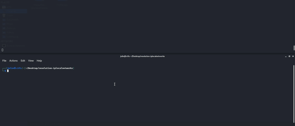

<div align="center" id="top"> 
  

  &#xa0;
</div>

<h1 align="center">Resolution Iplocalnetworks</h1>

<p align="center">
  

  

  

</p>


###### Directory Structure 
<br>

    .
    ├── ...
    ├── data                    # .nessus original files
    ├── data_changed            # .nessus file after changes
    ├── src                     # source program
    │   ├── hostnames           # Folder with control file
    │   ├── logging             # Log Folder
    │   │   └── logging.log     # File logging application
    │   └── ...
    └── ...

<br>

## :dart: About ##

Keeping a fixed private IP,  controlling IPs generated in DHCP and internal network VPN in nessus scanner files

<!-- ## :sparkles: Features ##

:heavy_check_mark: Feature 1;\
:heavy_check_mark: Feature 2;\
:heavy_check_mark: Feature 3; -->

## :rocket: Technologies ##

The following tools were used in this project:

- [Python](https://www.python.org/)


## :white_check_mark: Requirements ##

Before starting :checkered_flag:, you need to have [Python](https://www.python.org/) Libs installed.

## :checkered_flag: Starting ##

```bash
# Clone this project
$ git clone https://github.com/almeidajulio/resolution-iplocalnetworks

# Access
$ cd resolution-iplocalnetworks

# Install requirements
$ pip install -r requirements.txt

# Run the project
$ python .\src\main.py parser-nessus

# Run the project debug mode - insert flag "-d"
$ python .\src\main.py -d parser-nessus
```


Made with :heart: by <a href="https://github.com/almeidajulio" target="_blank">Julio Cesar Almeida</a>

&#xa0;

<a href="#top">Back to top</a>
